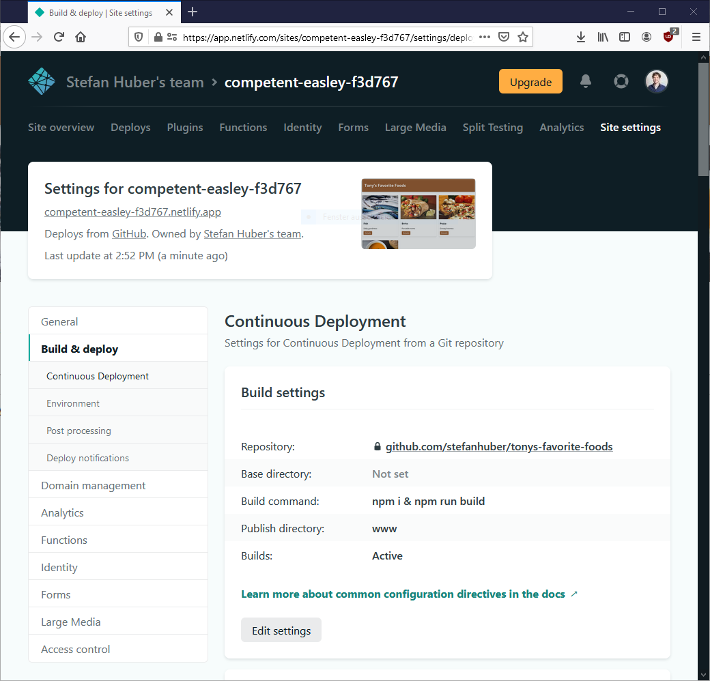
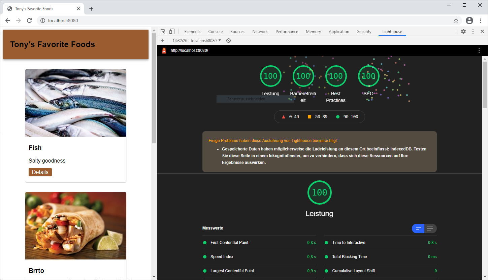

# Tony's Favorite Foods

## Netlify Projekt Setup

 - Es ist ein Repository auf Github zu erstellen, in dem sich das Projekt befinden soll
 - Ebenfalls soll mit Github ein Account bei Netlify erstellt werden und das Projekt soll mit Netlify verbunden werden
 - Das Netlify Projekt soll so eingerichtet werden, dass der Ordner `www` veröffentlicht wird und das ein Build durchgeführt wird `npm i & npm run build`, vergleiche die Deployment Einstellungen unten
 - Das Projekt soll über die von Netlify generierte URL zugänglich sein

## Lokales Projekt Setup

 - Starten Sie lokal einen Webserver `npm start`
 - Führen Sie lokal den Buildprozess aus: `npm run build`
 - Öffnen Sie das Projekt auf `http://localhost:8080`

## Ziel

## Vorgehen

 - Prüfen ob und welches Javascript wichtig ist für die Website ist und gegebenenfalls eliminieren oder umschreiben:
    - Coverage Tool von Chrome
    - Network Request Blocking   
 - Build Pipeline optimieren:
    - Bilder komprimieren ([sharp](https://www.npmjs.com/package/sharp))
    - CSS Minification ([csso](https://www.npmjs.com/package/csso))
    - JS Minification ([terser](https://www.npmjs.com/package/terser))
 - Layoutshifts eliminieren
 - SEO und Best Practices Check

## Abgabe

Link auf Netlify Website muss über Moodle abgegeben werden

## Häufige Fragen

### Wie bekommt man das Projekt auf Github?

 - Github Account muss vorhanden sein
 - `New Repository` auf Github erstellen
 - Projekt aus Gitlab der FH clonen: `git clone https://gitlab.web.fh-kufstein.ac.at/ebmi-2021/tonys-favorite-foods`
 - Remote Origin lokal löschen: `git remote remove origin`
 - Github Origin lokal hinzufügen: `git remote add origin URL-ZU-GITHUB-REPO`
 - `git push`

### Ist es ok, wenn nutzloses Javascript aus dem Projekt entfernt wird?

Ja, Ziel der Übung ist es alles nutzlose zu entfernen. Es soll nur das JS übrigbleiben, dass von Nutzem ist (kann auch leere Menge sein).

### Wie muss die Build Pipeline angepasst werden?

Innerhalb der Datei `scripts/build.js` müssen die genannten Bibliotheken (`csso`, `sharp`, ...) eingebunden werden. Das bestehende `scripts/build.js` kann vollkommen geändert werden.

### Dürfen im html Änderungen vorgenommen werden?

Ja.

### Dürfen Bilder mit Photoshop optimiert werden?

Nein, diese soll automatisch innerhalb der Build Pipeline angepasst werden.

